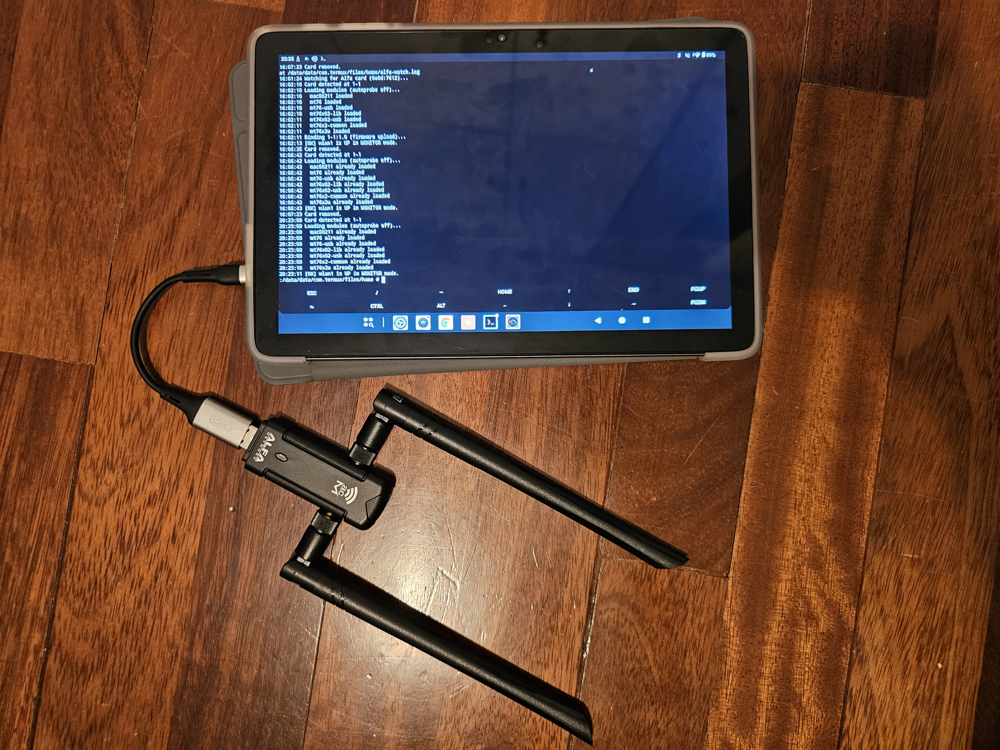
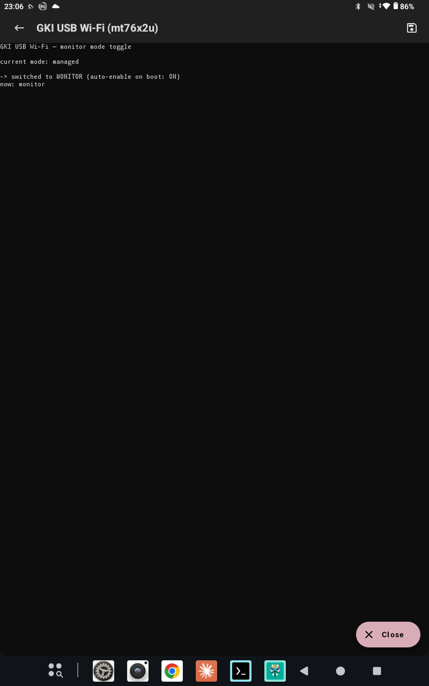
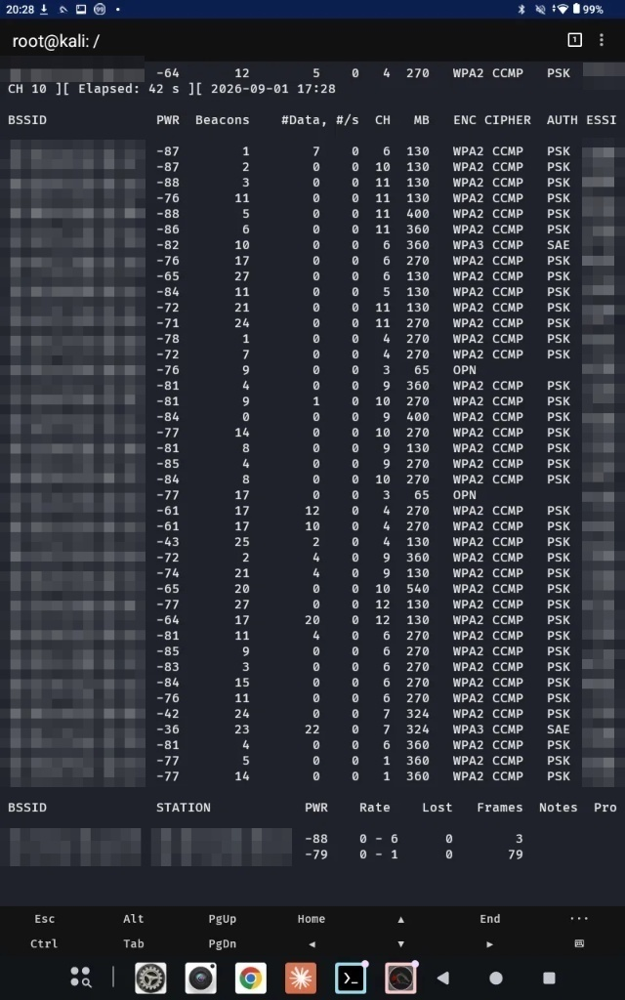
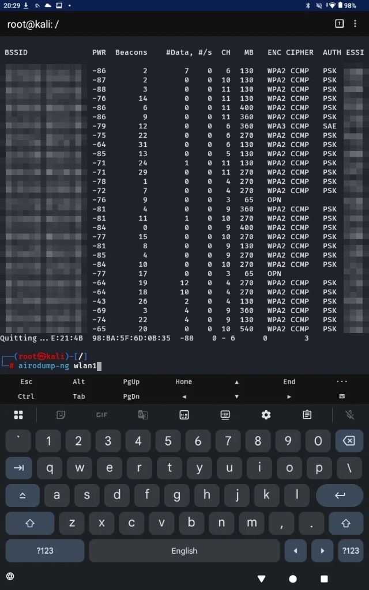

# android-gki-usb-wifi

Build and load **external USB Wi-Fi drivers** (monitor mode + injection) on
**rooted Android GKI devices** — onto the *running stock kernel*, without
replacing it or flashing anything.

Modern Android (kernel 5.10+) uses a **Generic Kernel Image (GKI)**: a common
kernel plus vendor modules. Most stock kernels ship `cfg80211` but **not**
`mac80211` or the USB-Wi-Fi driver stack, so external adapters (ALFA, TP-Link,
Panda, etc.) don't work out of the box. This repo builds the missing modules
against the **exact** Android Common Kernel commit your device runs, so they
load with matching symbol CRCs — no custom kernel, no boot-image patching.

> Originally developed and fully tested on a **Teclast P30T** (Unisoc UMS9230)
> with an **ALFA AWUS036ACM** (MT7612U). That path is the *reference* and is
> verified end-to-end. Other SoCs, kernels and adapters are supported on a
> best-effort basis — see the [support matrix](#support-matrix) for exactly
> what's tested vs. untested.



The watcher loads the driver stack automatically on plug-in and brings up
`wlan1` in monitor mode — no typing, straight from boot.

---

## Why this instead of a custom NetHunter kernel?

The usual way to get external USB Wi-Fi working on Android is to build a **whole
custom NetHunter kernel** with the drivers compiled in, and **flash it**. That
approach only exists for a handful of popular phones, is device-specific, risks
bricking, and **breaks on every OTA update**. If your device has no prebuilt
NetHunter kernel, you're stuck.

This project takes a different route: it builds just the **driver modules**
against your *running* stock kernel and loads them on top of it.

| | Custom NetHunter kernel | This project (external modules) |
|---|---|---|
| Flashing | Required (boot/kernel image) | **None** |
| Brick risk | Yes | **No** (nothing flashed) |
| Survives OTA updates | No (must rebuild/reflash) | **Yes** (just rebuild modules) |
| Device coverage | Only devices with a prebuilt kernel | **Any** GKI device that passes `detect.sh` |
| Internal Wi-Fi | Replaced | **Untouched** (loads alongside it) |
| Reverts by | Reflashing stock | **Reboot** (modules are not persistent) |

The trade-off: it's a *hybrid* runtime (stock `cfg80211` + external `mac80211`),
so it's best-effort per device — but when `detect.sh` says your device is
buildable, you get monitor mode without ever touching a partition.

## Will my device work?

Run `scripts/detect.sh` — it checks everything and gives a yes/no verdict. In
short, you need:

- **Rooted** Android with **Magisk** (to load modules + set the firmware path)
- A **GKI kernel** (5.10 / 5.15 / 6.1 / 6.6 — i.e. most devices on Android 12+)
- Module signature enforcement **off** (`CONFIG_MODULE_SIG_FORCE` not set) — the
  default on virtually all shipping Android kernels, since there's no Secure Boot
- Your kernel's **source commit public** on the Android Common Kernel tree
  (`detect.sh` verifies this with a live request)
- NetHunter (or a Kali chroot) for the userspace tools (`iw`, `airodump-ng`)

If those hold, the method works — it is **not** limited to the Teclast P30T; that
device is just the fully-tested reference. Devices with **no** custom NetHunter
kernel are exactly the ones this helps most.

## Support matrix

Legend: tested = verified on real hardware · built = compiles but not
hardware-verified · OOT = out-of-tree, may not build on every kernel.

### Adapters / drivers

| `driver` input | Chips | In-tree | Firmware | Status |
|---|---|---|---|---|
| `mt76x2u` | MT7612U / MT7662 | yes | `mt7662*.bin` | **tested** (AWUS036ACM) |
| `mt76x0u` | MT7610U/7630U/7650U | yes | `mt7610u.bin` … | built |
| `mt7601u` | MT7601U (2.4GHz) | yes | `mt7601u.bin` | built |
| `rt2800usb` | RT5370/5372/3070/3072/2870/3572 | yes | none | built (no firmware needed) |
| `ath9k_htc` | AR9271, AR7010 | yes | `htc_9271.fw`/`htc_7010.fw` | built (proven on this SoC in prior work) |
| `rtl8xxxu` | RTL8188CU/EU, RTL8192CU/EU | yes | none | built |
| `rtl88xxau_oot` | RTL8812AU/8814AU/8811AU/8821AU | **no** | in-driver | OOT |

`detect.sh` recognizes ~55 USB IDs across these families and picks the driver +
firmware automatically. It also flags adapters that show up in **CD-ROM /
driver-install mode** (e.g. `0bda:1a2b`) — those need `usb_modeswitch` before
they present as Wi-Fi at all. If yours isn't listed it prints `unrecognized` — the
adapter may still work; you'll just need to identify the chipset yourself.

### SoCs / devices

| Device | SoC | Status |
|---|---|---|
| Teclast P30T | Unisoc UMS9230 (T615) | **tested** |
| Other UMS9230/T615 on the same kernel string | Unisoc | likely (shared reference image) |
| Any other GKI device | any | works if `detect.sh` says buildable |

### Kernel generations

`android12-5.10` · `android13-5.15` · `android14-6.1` · `android15-6.6`
(the `kbranch` build input; `detect.sh` reports which one you're on).

**Honest limits:** modules only load if your kernel's commit is **public** on
the Android Common Kernel tree and the kernel doesn't enforce module signatures.
`detect.sh` checks both and tells you plainly. If your vendor never published
matching source, no build can produce loadable modules — a hard limit, not a bug.

---

## Install

Two ways. **A** is the easiest (flash once, done). **B** gives you the
plug-and-play watcher with automatic retries. You can use either; don't run both
loaders at the same time.

### A. Magisk / KernelSU module (recommended)

Prebuilt modules for the reference kernel are attached to the
[latest release](../../releases/latest). If your `uname -r` matches the one in
[COMPATIBILITY.md](COMPATIBILITY.md) exactly, use it directly; otherwise build
your own first (see [AUTOMATION.md](AUTOMATION.md)) — the workflow's artifact
**is** the flashable zip, no extracting needed.

1. Download the module zip (release asset, or the `gki-usb-wifi-<commit>-<driver>`
   build artifact).
2. **Magisk Manager → Modules → Install from storage** → pick the zip.
3. Reboot, unlock the device, then plug the adapter in.

The module shows up with an **Action** button:


It loads the driver stack at boot (safely — USB autoprobe off, then sysfs bind,
so the vendor watchdog can't panic), stages the firmware, and brings `wlan1` up
in monitor mode on its own. Check what it did:

```
su
cat /data/adb/modules/gki_usb_wifi_*/load.log
ip link show wlan1        # monitor mode shows: link/ieee802.11/radiotap
```

Press **Action** any time to toggle monitor ↔ managed (it also remembers the
choice for next boot):



> The Action button needs **Magisk v27+** (or KernelSU/APatch — the same zip
> works on all three). On older Magisk the module still works; just set monitor
> mode from the NetHunter chroot.

If it worked on your device, there's a pre-filled compatibility-report link
waiting in `/data/adb/modules/gki_usb_wifi_*/report-link.txt` — opening it is
entirely optional, and nothing is ever sent automatically.

### B. Scripts (plug-and-play watcher)

```
pkg install git curl unzip
git clone https://github.com/markatsos/android-gki-usb-wifi
cd android-gki-usb-wifi
su
sh scripts/detect.sh          # confirms your device + adapter
sh scripts/install.sh         # modules + firmware + boot script, starts the watcher
```

Then plug the adapter in; the watcher loads the stack, retries on firmware
timeouts, and sets monitor mode via the Kali chroot:

```
cat ~/usbwifi-watch.log       # -> [OK] wlan1 is UP in MONITOR mode.
```

`iw` / `airodump-ng` live in the NetHunter (Kali) chroot — **open the NetHunter
app once per boot** before capturing, so the chroot mounts are active.

On **any other device / adapter**, run `detect.sh`, read its verdict, and follow
[AUTOMATION.md](AUTOMATION.md) to build for your specific kernel.
Starting fresh? See [CLEAN-REINSTALL.md](CLEAN-REINSTALL.md).

Hitting an error? See **[TROUBLESHOOTING.md](TROUBLESHOOTING.md)**.

---

## Demo

`airodump-ng wlan1` scanning in monitor mode via the external adapter, alongside
the tablet's internal Wi-Fi. BSSIDs and network names are redacted.





---

## How it works (the three problems solved)

1. **Missing driver stack.** The workflow builds `mac80211` + the chosen USB
   driver as modules from the exact ACK commit, with `CONFIG_MODVERSIONS` so the
   result links against the *stock* `cfg80211` already loaded on the device.
2. **BTF/CRC mismatch.** Stock kernels built with `CONFIG_DEBUG_INFO_BTF=y`
   change `struct module` and thus the `module_layout` CRC. The workflow installs
   `pahole` and keeps BTF enabled so the CRC matches (`0x0222dd63` on the P30T).
3. **Vendor watchdog panic.** Unisoc's `native_hang_monitor` panics the kernel if
   a module's `init` takes >~2s. USB drivers upload firmware during probe, which
   is slower. The loader inserts modules with USB **autoprobe disabled** (so
   `module_init` returns instantly), then binds the device via sysfs — the slow
   firmware upload happens *outside* the watchdog-timed path.

---

## Confirmed reference environment

| Item | Value |
|---|---|
| Device | Teclast P30T (`P30T_ROW`) |
| Android | 16 (SDK 36) |
| SoC | Unisoc/Spreadtrum UMS9230 (`ums9230_6h10`, T615) |
| Kernel | `5.15.178-android13-8-00012-g4ea0fcb5d130-ab13530115` |
| ACK commit | `4ea0fcb5d1308f2f5a5dec0a3a5c8f1b261e00c7` |
| Toolchain | Android Clang `r450784e` (14.0.7) |
| `MODVERSIONS` / BTF / LTO | y / y / full |
| `module_layout` CRC | `0x0222dd63` |
| Adapter | ALFA AWUS036ACM (MT7612U, `0e8d:7612`) |

---

## What this repo does NOT commit

- compiled `.ko` in the source tree (GPL-derived **and** build-specific — a
  module built for another kernel is rejected by `CONFIG_MODVERSIONS`). Prebuilt
  modules for the reference device are attached to a **release**, not to `main`.
- firmware blobs — fetched at install time from
  [`linux-firmware`](https://gitlab.com/kernel-firmware/linux-firmware)
- boot/vendor images or extracted vendor trees

---

## Build it yourself / other devices

Full flow in [AUTOMATION.md](AUTOMATION.md):

1. `scripts/detect.sh` reads your kernel/commit/config, recognizes your adapter,
   and writes `device-profile.txt` with a clear verdict.
2. **Actions → Build Wi-Fi modules (parametrized)** takes those values as inputs
   (defaults are the P30T's) and builds the driver set — 6 driver families,
   kernels 5.10–6.6.
3. `scripts/install.sh` fetches the modules (release asset) + firmware and sets
   everything up, including a Magisk boot script.

---

## Scripts

See [`scripts/README.md`](scripts/README.md).

| Script | Role |
|---|---|
| `detect.sh` | Probe device + adapter; write `device-profile.txt`; verdict + a pre-filled compatibility-report link. Read-only, no telemetry. |
| `install.sh` | Download modules (release) + firmware; install loader + boot script; migrates older layouts. |
| `usbwifi-watch.sh` | Plug-triggered loader; USB-reset retry on firmware timeouts; sets monitor mode via the Kali chroot. |
| `usbwifi-boot.sh` | Magisk `service.d` auto-start (waits for unlock; kill-switch `/data/adb/usbwifi-disable`). |
| `usbwifi-up.sh` | Manual one-shot loader. |
| `isolate-wlan1.sh` | **Experimental**: keep Android's Wi-Fi framework off `wlan1` during captures. |

The Magisk module ships its own `service.sh` (boot loader) and `action.sh`
(the monitor-mode toggle button).

---

## Warnings

- **Only for networks you own or are explicitly authorized to test.**
- **Only `mt76x2u` on the P30T is hardware-verified.** Other drivers are built
  correctly but not yet tested on real hardware — treat "built"/OOT rows as
  best-effort. Reports welcome.
- This is a **hybrid** wireless runtime (stock `cfg80211` + custom `mac80211`).
  Monitor mode + scanning work; injection wasn't exhaustively validated — test
  with `aireplay-ng --test wlan1`.
- **Open NetHunter once per boot before plugging in the adapter.** Monitor mode
  is set via `iw` inside the Kali chroot; its mounts must be active first, or the
  switch fails silently (the adapter still appears as `wlan1`).
- **Never load a custom `cfg80211.ko`.** The internal vendor Wi-Fi depends on the
  stock one; the scripts delete any built `cfg80211.ko` and never deploy it.
- **Out-of-tree Realtek (`rtl88xxau_oot`) may not build** on every kernel — it
  depends on an external driver repo supporting your version.
- **Boot auto-start** waits for the device to be unlocked (CE storage) before
  loading; it's boot-safe and has a kill-switch (`touch /data/adb/usbwifi-disable`).
  Keep `adb` handy the first time.
- Boot with the card unplugged, then plug it in after unlock.
- OTG gives limited current; use a **powered OTG hub** if you see drops under load.

---

## Credits

Built through iterative debugging on real hardware. The general "external modules
on a stock GKI kernel" approach — and the specific ACK commit / `module_layout`
CRC for this kernel — were cross-checked against the
[Cubot KingKong ES3 root guide](https://github.com/KiMiGuel/Root-Guide-Cubot-KingKong-ES-3---Unisoc-T615-ums9230-)
by KiMiGuel, which proved the method for AR9271 on the same kernel. This repo
extends it to MediaTek/Ralink/Realtek and full plug-and-play automation.

## License

Scripts and workflow: MIT (see `LICENSE`). Built kernel modules are GPL-2.0
(they derive from the Linux kernel). Firmware is proprietary to its vendors and
is not distributed here.
